## 실행 컨텍스트
### 소스코드의 타입
- 소스코드의 타입에 따라 실행 컨텍스트를 생성하는 과정과 관리 내용이 다르다.

소스코드의 타입 | 설명
--|--
전역코드 | 전역에 존재하는 소스코드. 전여게 정의된 함수, 클래스 등의 내부 코드는 포함되지 않는다.
함수코드 | 함수 내부에 존재하는 소스코드. 함수 내부에 중첩된 함수, 클래스 등의 내부 코드는 포함되지 않는다.
eval코드 | 빌트인 전역 함수인 eval 함수에 인수로 전달되어 실행되는 소스코드.
모듈코드 | 모듈 내부에 존재하는 소스코드. 모듈 내부의 함수, 클래스 등의 내부 코드는 포함되지 않는다.

**1. 전역코드**
- 전역 변수를 관리하기 전역 스코프를 생성해야 한다.
- `var` 키워드로 선언된 전역 변수와 함수 선언문으로 정의된 전역 함수를 전역 객체의 프로퍼티와 메서드로 바인딩하고 참조하기 위해 전역 객체와 연결되어야 한다.

**2. 함수코드**
- 지역 스코프를 생성하고 지역 변수, 매개변수, arguments 객체를 관리해야 한다.
- 생성한 지역 스코프를 스코프 체인의 일원으로 연결해야 한다.

**3. eval코드**
- strict mode(엄격 모드)에서 자신만의 독자적인 스코프를 생성한다.

**4. 모듈코드**
- 모듈별로 독립적인 모듈 스코프를 생성한다.

<br>

### 소스코드의 평가와 실행
- 자바스크립트 엔진은 모든 소스코드를 **소스코드의 평가**와 **소스코드의 실행** 과정으로 나누어 처리한다.
- **소스코드의 평가**
  - 실행 컨텍스트를 생성.
  - 변수, 함수 등의 **선언문**만 먼저 실행하여 생성된 식별자를 **키**로 실행 컨텍스트가 관리하는 **스코프(렉시컬 환경의 환경 레코드)** 에 등록.
- **소스코드의 실행**
  - 변수나 함수의 참조를 실행 컨텍스트가 관리하는 스코프에서 검색해서 취득.
  - 변수 값의 변경 등 소스코드의 실행 결과를 다시 실행 컨텍스트가 관리하는 스코프에 등록.

<br>

### 실행 컨텍스트의 역할
**코드가 실행되려면**
- 스코프를 구분하여 식별자와 바인딩된 **값이 관리**되어야 하고 중첩 관계에 의해 스코프 체인을 형성하여 **식별자를 검색**할 수 있어야 한다.
- 전역 객체의 프로퍼티도 전역 변수처럼 검색 할 수 있어야 한다.
- 함수 호출이 종료되면 함수 호출 이전으로 되돌아가기 위해 현재 실행 중인 코드와 이전에 실행하던 코드를 구분하여 관리해야 한다.

**실행 컨텍스트의 역할**
- 실행 컨텍스트는 식별자를 등록하고 관리하는 스코프와 **코드 실행 순서 관리**를 구현한 내부 메커니즘으로, **모든 코드는 실행 컨텍스트를 통해 실행되고 관리**된다.
- **식별자와 스코프**는 실행 컨텍스트의 **렉시컬 환경**으로 관리하고 **코드 실행 순서**는 **실행 컨텐스트 스택**으로 관리한다.

<br>

### 실행 컨텍스트 스택


```js
const x = 1;
function foo () {
  const y = 2;

  function bar () {
    const z = 3;
    console.log(x + y + z);
  }

  bar();
}

foo(); // 6
```

<div style="text-align: center;">
  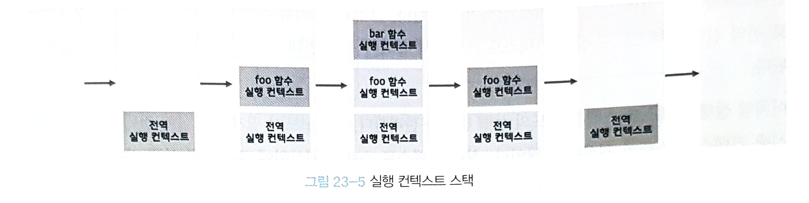
</div>

- 실행 컨텍스트 스택은 **코드의 실행 순서를 관리**한다.
- 소스코드가 평가되면 실행 컨텍스트가 생성되고 실행 컨텍스트 스택의 최상위에 쌓인다.
- 스택의 최상위에 존재하는 실행 컨텍스트는 언제나 현재 실행 중인 코드의 실행 컨텍스트다.

<br>

### 렉시컬 환경
- 식별자와 식별자에 바인딩된 값, 상위 스코프에 대한 참조를 기록하는 자료구조로 **실행 컨텍스트를 구성하는 컴포넌트**다.
- 렉시컬 환경은 두 개의 컴포넌트로 구성된다.
  - 환경 레코드
    - 스코프에 포함된 식별자를 등록하고 등록된 식별자에 바인된 값을 관리하는 저장소다.
  - 외부 렉시컬 환경에 대한 참조
    - 해당 실행 컨텍스트를 생성한 소스코드를 포함하는 **상위 코드의 렉시컬 환경을 가리킨다.**

<div style="text-align: center;">
  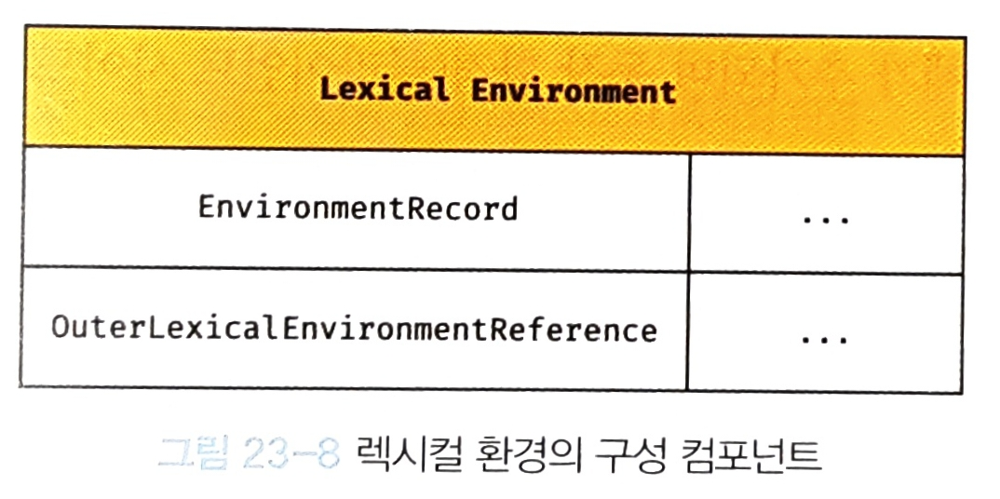
</div>

<br>

### 실행 컨텍스트의 생성과 식별자 검색 과정
#### 1. 전역 객체 생성
- 전역 객체는 **전역 코드가 평가되기 이전에 생성**된다.
- 전역 객체에는 빌트인 전역 프로퍼티와 빌트인 전역 함수, 그리고 표준 빌트인 객체가 추가되며 동작 환경(클라이언트 사이드 또는 서버 사이드)에 따라 클라이언트 사이드 Web API 또는 특정 환경을 위한 호스트 객체를 포함한다.
- 전역 객체도 `Object.prototype`을 상속받는다.

#### 2. 전역 코드 평가
```js
var x = 1;
const y = 2;

function foo (a) {
  var x = 3;
  const y = 4;

  function bar (b) {
    const z = 5;
    console.log(a + b + x + y + z);
  }

  bark(10);
}

foo(20); // 42
```
전역 코드의 평가는 다음과 같은 순서로 진행된다.
#### 2-1. 전역 실행 컨텍스트 생성
- 비어있는 전역 실행 컨텍스트를 생성하여 실행 컨텍스트 스택에 푸시한다.
- 전역 실행 컨텍스트는 실행 컨텍스트 스택의 최상위가 된다.
#### 2-2. 전역 렉시컬 환경 생성
- 전역 렉시컬 환경을 생성하고 전역 실행 컨텍스트에 바인딩 한다.
- 전역 렉시컬 환경은 **환경 레코드**와 **외부 렉시컬 환경에 대한 참조**로 구성된다.
##### 2-2.1 전역 환경 레코드 생성
- 전역 환경 레코드는 **객체 환경 레코드**와 **선언적 환경 레코드**로 구성된다.
- **객체 환경 레코드**
  - 객체 환경 레코드는 `BindingObject`라고 부르는 객체와 연결된다.
  - 전역 코드 평가 과정에서 `var` 로 선언한 전역 변수와 함수 선언문으로 정의된 전역 함수는 전역 환경 레코드의 객체 환경 레코드에 연결된 `BindingObject`를 통해 전역 객체의 프로퍼티와 메서드가 된다.
- **선언적 환경 레코드**
  - `let`, `const` 키워드로 선언한 전역 변수는 선언적 환경 레코드에 등록되고 관리된다.
  - `const` 키워드로 선언한 변수는 **선언 단계**와 **초기화 단계**가 분리되어 런타임에 실행 흐름이 변수 선언문에 도달하기 전까지 **일시적 사각지대**에 빠지게 된다.
```js
let foo = 1; // 전역 변수
{
  // let 으로 선언한 변수도 호이스팅이 발생하기 때문에
  // 참조 에러(ReferenceError)가 발생한다.
  console.log(foo);
  let foo = 2; // 지역 변수
}
```
##### 2-2.2 this 바인딩
- 전역 환경 레코드의 `[[GlobalThisValue]]` 내부 슬롯에 `this`가 바인딩된다.
- 전역 코드에서 `this`는 전역 객체를 가리키므로 전역 환경 레코드의 `[[GlobalThisValue]]` 내부 슬롯에는 **전역 객체**가 바인딩된다.
- `this` 바인딩은 전역 환경 레코드와 함수 환경 레코드에만 존재한다.
##### 2-2.3 외부 렉시컬 환경에 대한 참조 결정
- 외부 렉시컬 환경에 대한 참조는 현재 평가 중인 소스코드를 포함하는 외부 소스코드의 렉시컬 환경, 즉 **상위 스코프를 가리킨다.
- 전역 렉시컬 환경의 외부 렉시컬 환경에 대한 참조는 `null`이 할당된다.(스코프 체인의 종점.)

<div style="text-align: center;">
  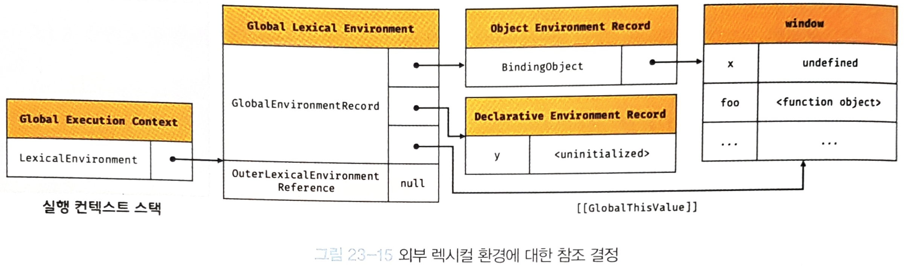
</div>

#### 3. 전역 코드 실행
- 변수 할당문이 실행되어 전역 변수에 값이 할당된다.
- 만약 실행중인 실행 컨텍스트의 렉시컬 환경에서 식별자를 검색할 수 없으면 외부 렉시컬 환경에 대한 참조가 가리키는 렉시컬 환경, 즉 상위 스코프로 이동하여 식별자를 검색한다.

<div style="text-align: center;">
  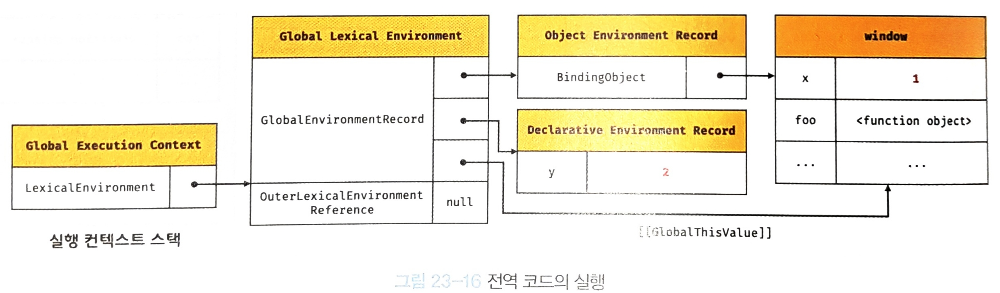
</div>


#### 4. foo 함수 코드 평가
- 함수 렉시컬 환경을 구성하는 컴포넌트는 **함수 환경 레코드**와 **외부 렉시컬환경에 대한 참조**를 컴포넌트로 가진다.
- **함수 환경 레코드**는 매개변수, `arguemnts` 객체, 함수 내부에서 선언한 지역 변수와 중첩 함수를 관리한다.
- 함수 객체의 내부 슬롯 `[[Environment]]`는 함수의 상위 스코프의 렉시컬환경을 가리킨다. 
<div style="text-align: center;">
  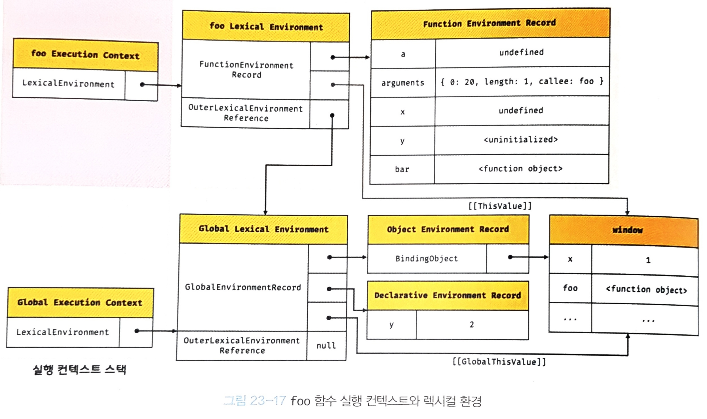
</div>

#### 5. foo 함수 코드 실행

<div style="text-align: center;">
  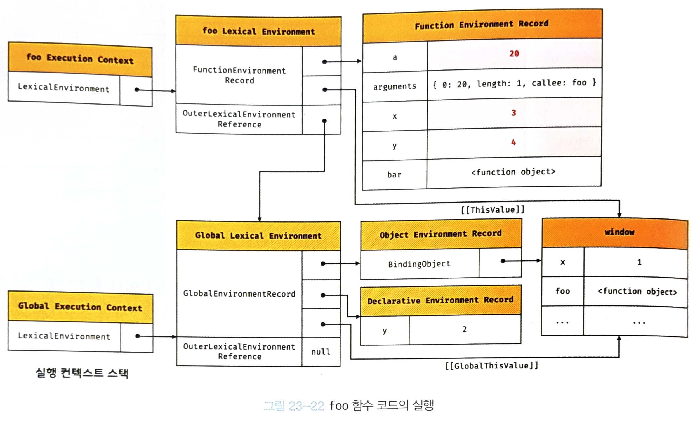
</div>

#### 6. bar 함수 코드 평가

<div style="text-align: center;">
  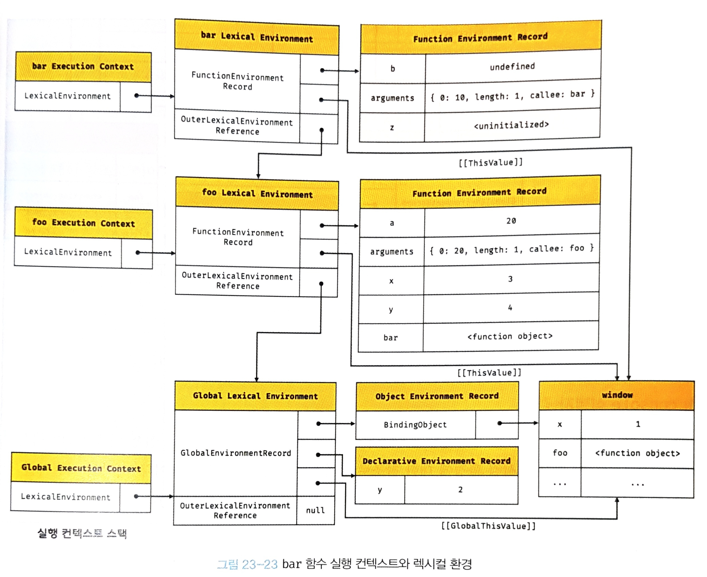
</div>

#### 7. bar 함수 코드 실행

<div style="text-align: center;">
  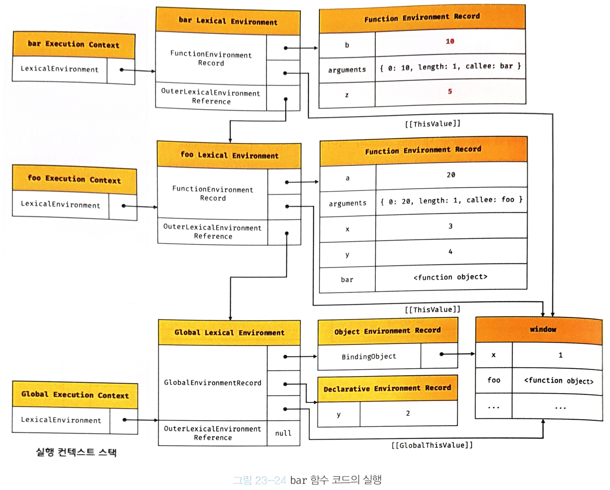
</div>

#### 8. bar 함수 코드 실행 종료
- 실행 컨텍스트 스택에서 `bar` 함수 실행 컨텍스트가 팝되어 제거되고 `foo` 실행 컨텍스트가 실행 중인 실행 컨텍스트가 된다.
- 스택에서 실행 컨텍스트가 제거되었다고 함수 렉시컬 환경까지 즉시 소멸하는 것은 아니다.
- 객체를 포함한 모든 값은 누군가에 의해 **참조되지 않을 때** 비로소 가바지 컬렉터에 의해 소멸한다.

<div style="text-align: center;">
  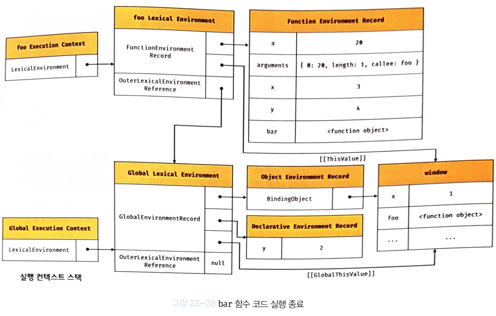
</div>

#### 9. foo 함수 코드 실행 종료

<div style="text-align: center;">
  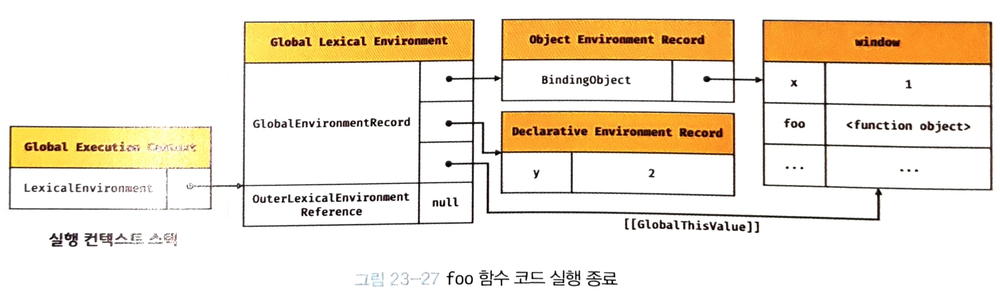
</div>

#### 전역 코드 실행 종료
- 더는 실행할 전역 코드가 없으면 전역 실행 컨스트도 실행 컨텍스트 스택에서 팝되어 스택에는 아무것도 남아 있지 않게 된다.

<br>

### 실행 컨텍스트와 블록 레벨 스코프
- `let`, `const` 키워드로 선언한 변수는 코드 블록(함수, if문, for문, while문, try/catch문 등)을 지역 스코프로 인정하는 **블록 레벨 스코프**를 가진다.
- 이를 위해 **블록 레벨 렉시컬 환경**이 생성된다. 
- 블록 레벨 렉시컬 환경은 선언적 환경 레코드와 외부 렉시컬 환경에 대한 참조를 컴포넌트로 가진다.
- 외부 렉시컬 환경에 대한 참조는 블록이 실행되기 이전의 렉시컬 환경을 가리킨다.

<div style="text-align: center;">
  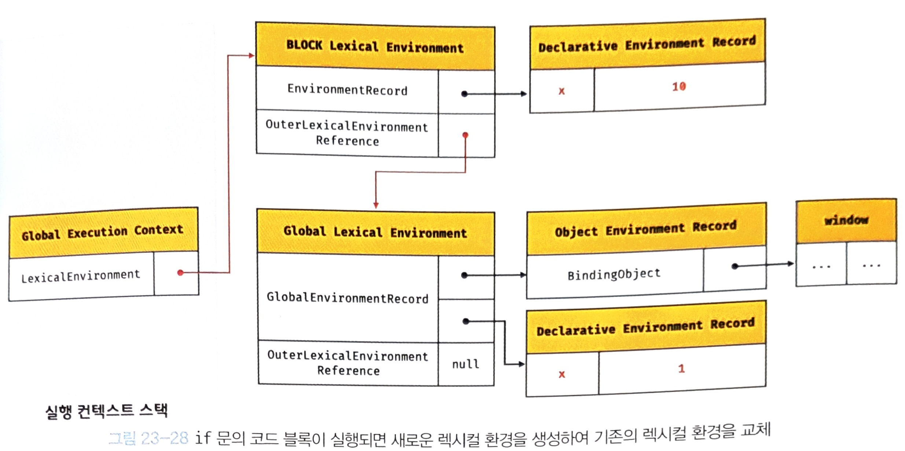
</div>